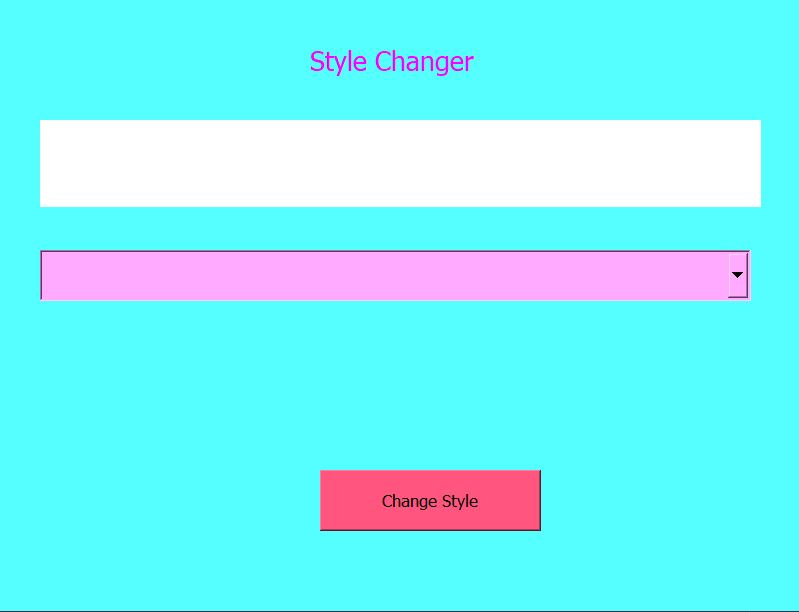
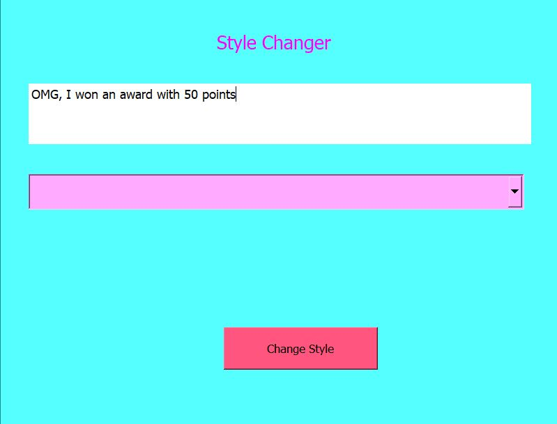
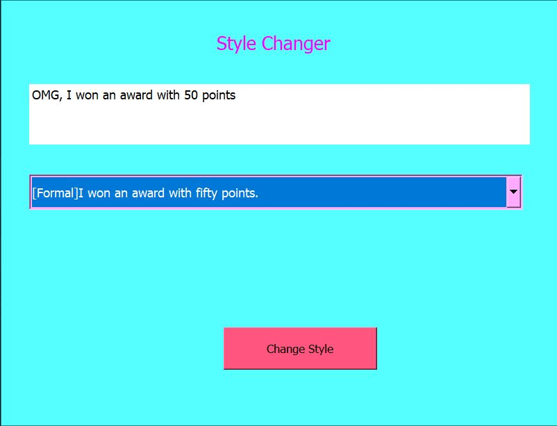
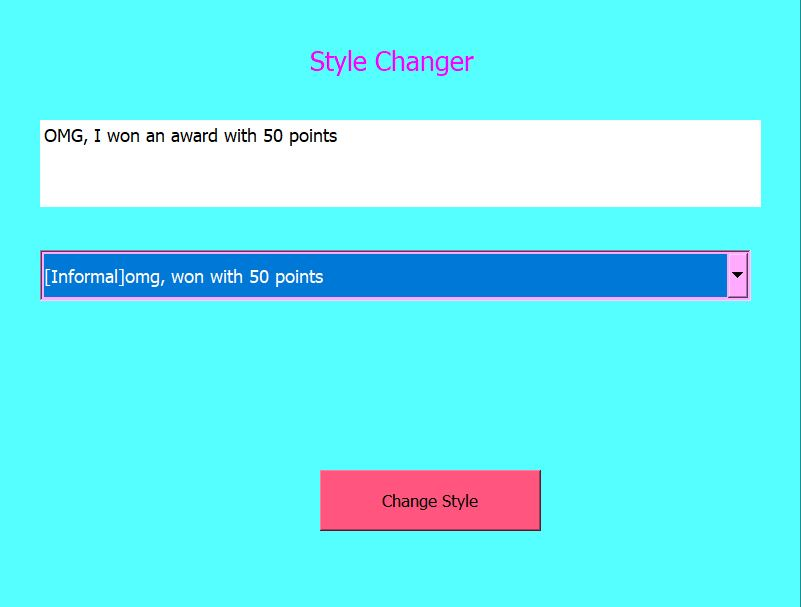

# Style-Changer
An Interactive app for suggesting casual and formal styles of text

## Libraries
- Pytorch
- [Styleformer](https://github.com/PrithivirajDamodaran/Styleformer)
- PyQt5

## Usage
- Install all the libraries
- use the following to start the application
  ```shell
  cd Style Changer
  python style_changer.py
  ```
  <p align="center">
    
  </p>
 - Type the text in the blank box
  <p align="center">
    
  </p>
 - Click the <i>Change Style</i> button<br>
 - The suggestions will appear in the drop down menu</br></br>
 
  <p align="center">
    
  </p>
  <p align="center">
    
  </p><br>
 
 ## Demo Video
   
